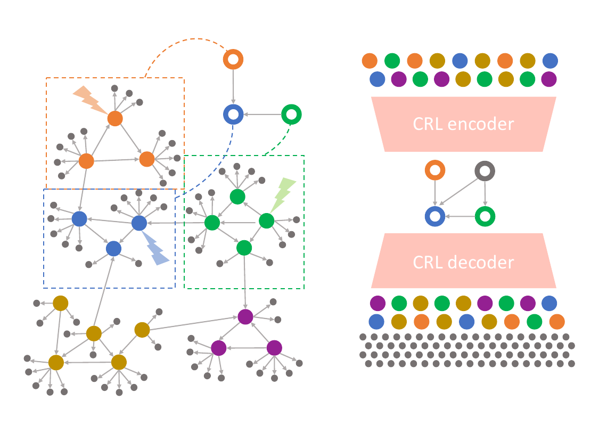

# gCRL

This repository contains the code for the paper:

> **Bridging Gene Regulatory Networks and Causal Representation Learning in Single-Cell Genomics Data**
> Vincenzo Lagani, Giorgi Sokhadze, Liliia Nigmetzianova, Robert Lehmann, Yiling Ma, Sumeer Ahmad Khan, Xabier Martinez de Morentin, Narsis A. Kiani, Mikel Hernaez, Alexander A. Lukyanov, Jesper Tegnér, David Gomez-Cabrero
> *ICML 2026 Workshop GenBio*
> [https://openreview.net/forum?id=OBH7Lv5JoV](https://openreview.net/forum?id=OBH7Lv5JoV)

**Abstract:** Understanding gene regulatory mechanisms is key to advancing our capacity to interpret and manipulate cellular physiology, with significant implications for bioengineering and precision medicine. Two major computational paradigms, namely gene regulatory network (GRN) reconstruction and causal representation learning (CRL), offer distinct perspectives on transcriptional regulation. GRN methods focus on capturing detailed, fine-scale interactions among genes and transcription factors, whereas CRL seeks to identify a small set of latent variables that drive gene expression, providing a coarser but potentially more generalizable representation. In this work, we propose methods that incorporate GRN-derived structures into CRL models, guiding their training and enriching their biological interpretability. Computational experiments on scPerturb-seq datasets demonstrate that GRNs and CRL can work in concert, yielding biologically interpretable latent representations without sacrificing predictive performance.



---

**gCRL** (GRN-informed Causal Representation Learning) is a framework for learning structured latent representations of single-cell CRISPR perturbation data. It uses Gene Regulatory Networks (GRNs) as structural priors to align the latent space with biologically meaningful axes (eigengenes), enabling zero-shot generalisation to unseen combinations of perturbations.

Two model variants are provided: **gCRL-AE** (autoencoder) and **gCRL-VAE** (variational autoencoder).

---

## Installation

The project requires **two separate environments**:

| Environment | Purpose | Notebooks |
|---|---|---|
| `gcrl` conda environment | gCRL package, model training, evaluation | All notebooks **except** GRN calculation |
| CellOracle (Docker) | GRN inference | `1_GRN_calculation.ipynb` only |

### Environment 1 — gCRL (conda + pip)

**Prerequisites:** [Anaconda](https://www.anaconda.com/download) or [Miniconda](https://docs.conda.io/en/latest/miniconda.html), and a CUDA-capable GPU (recommended; CPU-only execution is possible but slow for model training).

```bash
# 1. Clone the repository
git clone <repository-url>
cd gCRL

# 2. Create and activate the conda environment
conda env create -f environment.yml
conda activate gcrl

# 3. Install the gCRL package in editable mode
pip install -e .
```

After installation, the package is importable as:

```python
import gcrl
from gcrl.models import gcrl_ae, gcrl_vae
```

> **GPU note:** The `environment.yml` installs a CPU-only PyTorch build by default. GPU support is strongly recommended for the modeling notebooks. To enable it, visit [pytorch.org/get-started/locally](https://pytorch.org/get-started/locally/), select your operating system and CUDA version, and run the generated `pip install torch ...` command after activating the `gcrl` environment. This will replace the CPU build with the correct CUDA-enabled wheel for your system.

### Environment 2 — CellOracle (Docker)

CellOracle is used exclusively for GRN inference (`1_GRN_calculation.ipynb` in each preprocessing pipeline) and must be run inside the provided Docker container.

**Prerequisites:** [Docker](https://docs.docker.com/get-docker/) installed and running.

```bash
# Pull the image (one-time, ~11 GB)
docker pull kenjikamimoto126/celloracle_ubuntu:0.18.0
```

Once the image is available, launch Jupyter Lab inside the container and open the GRN notebook in your browser. The entire repository should be mounted as a volume so that all notebooks, data, and outputs are directly accessible.

For setup and usage details refer to the [official CellOracle documentation](https://morris-lab.github.io/CellOracle.documentation/).

---

## Data

Raw data files are not included in the repository. Download instructions for each dataset are provided in the corresponding data folders:

- [`data/real/Joung2023/README.md`](data/real/Joung2023/README.md) — Joung et al. 2023 TF Atlas (GEO: GSE217460, GSE217066)
- [`data/real/Norman2019/README.md`](data/real/Norman2019/README.md) — Norman et al. 2019 (GEO: GSE133344)

---

## Repository layout

```
assets/                    # figures used in this README

src/gcrl/                  # Python package (import gcrl)
  data/                    # IO & preprocessing utilities
  grn/                     # GRN communities and eigengene computation
  models/                  # gCRL-AE / gCRL-VAE (nn.Modules)
  training/                # training loops, schedulers, callbacks
  alignment/               # latent-to-eigengene alignment & partial-MCC
  evaluation/              # metrics and plotting
notebooks/
  00_data_preprocessing/
    Joung2023_preprocessing/   # notebooks 0–3 for the Joung 2023 dataset
    Norman2019_preprocessing/  # notebooks 1–3 for the Norman 2019 dataset
  10_modeling_gcrl_ae/         # AE training and evaluation
  20_modeling_gcrl_vae/        # VAE training and evaluation
  30_figures/                  # figure-generation notebooks and R scripts

data/
  example/                 # small synthetic dataset for the simple example notebook
  real/
    Joung2023/             # downloaded externally (see README therein)
    Norman2019/            # downloaded externally (see README therein)
  reference/
    ontologies/go-basic.obo  # Gene Ontology OBO file (tracked via Git LFS)

results/
  figures/                 # figure outputs (png/svg) and intermediate data
  real/                    # model outputs produced by the modeling notebooks

tests/                     # unit tests
```

---

## Running the notebooks

Notebooks within each preprocessing pipeline should be executed in order (0 → 1 → 2 → 3). The notebook that requires the CellOracle Docker is indicated below.

### Joung 2023 (`notebooks/00_data_preprocessing/Joung2023_preprocessing/`)

| Notebook | Environment |
|---|---|
| `0_data_preprocessing.ipynb` | `gcrl` conda env |
| `1_GRN_calculation.ipynb` | **CellOracle Docker** |
| `2_TF_module_identification.ipynb` | `gcrl` conda env |
| `3_data_preparation.ipynb` | `gcrl` conda env |

### Norman 2019 (`notebooks/00_data_preprocessing/Norman2019_preprocessing/`)

| Notebook | Environment |
|---|---|
| `1_GRN_calculation.ipynb` | **CellOracle Docker** |
| `2_TF_module_identification.ipynb` | `gcrl` conda env |
| `3_data_preparation.ipynb` | `gcrl` conda env |

### Modeling (`notebooks/10_modeling_gcrl_ae/`, `notebooks/20_modeling_gcrl_vae/`)

All modeling notebooks use the `gcrl` conda environment.

---

## Acknowledgements

The original code for the discrepancy-VAE used in our experiments is available at [https://github.com/uhlerlab/discrepancy_vae](https://github.com/uhlerlab/discrepancy_vae).

---

## Citation

If you use this code in your research, please cite:

```bibtex
@inproceedings{lagani2026bridging,
  title     = {Bridging Gene Regulatory Networks and Causal Representation Learning in Single-Cell Genomics Data},
  author    = {Lagani, Vincenzo and Sokhadze, Giorgi and Nigmetzianova, Liliia and Lehmann, Robert and Ma, Yiling and Khan, Sumeer Ahmad and Martinez de Morentin, Xabier and Kiani, Narsis A. and Hernaez, Mikel and Lukyanov, Alexander A. and Tegn{\'e}r, Jesper and Gomez-Cabrero, David},
  booktitle = {ICML 2026 Workshop on Generative Models for Biology (GenBio)},
  year      = {2026},
  url       = {https://openreview.net/forum?id=OBH7Lv5JoV}
}
```
